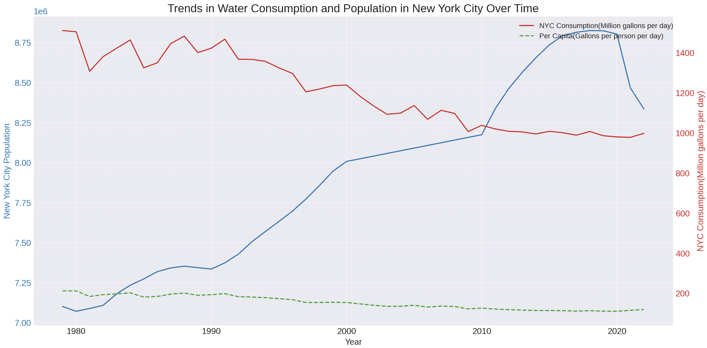

# ChatGPT Advanced Data Analysis

This is a brief introduction to the ChatGPT Advanced Data Analysis model. We will cover:

- How to access the model.
- Helpful prompting techniques.
- Key capabilities, like data summarization, error detection, and visualization.

Always double-check and verify the model's results for accuracy.

**Requirements:**

- ChatGPT Plus subscription.

**How to Enable:**

1. Go to Settings.
2. Navigate to Beta features.
3. Enable "Advanced Data Analysis".

**Potential Uses:**

- Exploratory data analysis.
- Visualizing data.
- Brainstorming and developing new ideas.

**Data Source:**

- Available at: [NYC Open Data](https://data.cityofnewyork.us/Environment/Water-Consumption-in-the-City-of-New-York/ia2d-e54m)
- *"A brief history of water consumption in the New York City Water Supply System (Based on New York City Census population)"*

**How to Download the Data:**

1. Navigate to the provided link.
2. Click on "Export".
3. Choose "CSV for Excel".

**How to Use Advanced Data Analysis in ChatGPT:**

1. Start a new chat session.
2. Hover over the GPT-4 tab.
3. Select "Advanced Data Analysis (Beta)".

### Initial Prompt

For better results, it helps to provide the model with context. In your initial prompt you could state your objective, the desired expertise level, the target audience, and any specific instructions (you don't have to know all of this from the start; you can adjust and refine your prompts as you go):

1. **Expertise Context**:
   - Define the ideal responder's background. 
   - E.g., "As a seasoned climate scientist..."

2. **Audience**:
   - Mention the target audience.
   - E.g., "Explain to first-year college students..." or "For experts in the field..."

3. **Specific Instructions**:
   - Desired answer style: "Briefly describe..." vs. "Elaborate on..."
   - Technicality: "Use and explain jargon..." or "Avoid technical terms..."

**Prompt**

> You are a skilled data scientist and quantitative researcher. I'm a software developer exploring a water consumption dataset. While I understand quantitative methods, I'm not a specialist like you. Please avoid using highly technical jargon when explaining concepts. If a qualitative perspective provides deeper insight, do highlight it. I appreciate responses that are both concise and detailed.

### Data & Fields Summary 

After the initial "instruction" and "role" prompt above, I click on the "+" icon, attach the data file, and ask: 

**Prompt**
> Please provide a brief summary of the data. Additionally, describe the fields.

### Errors, Outliers, Anomalies

Before going deeper into the data, it can be useful to check for errors, outliers, and anomalies:

**Prompt**
> Can you check the dataset for errors, significant outliers, and highlight any other unusual anomalies?

**Result**
> It appears that there are several rows where the 'New York City Population' contains a decimal point. These are likely rounding errors or data entry mistakes since it's unusual to have fractional values for population counts.

> *'New York City Population' and 'NYC Consumption(Million gallons per day)' are currently formatted as **objects** (most likely because of the commas). For easier analysis, we should convert these to numerical data types.*

Two notable anomalies: the population field contains decimal points, and another field is formatted as "objects", which refers to "strings" or "text". The term "objects" stems from my initial prompt where I mentioned being a "software developer".

### Data Visualization

If you have specific preferences (e.g., colors, labels), include those details in your request:

**Prompt**

> Can you create a line chart to display the trends over time?

If the result isn't what you expect. You can try prompting it again by pointing out what went wrong:

**Prompt**

> The scales don't work for all three columns and I can't see the green line. 

**Result:**

### Blended Inquiry through LLMs

LLMs allow you to blend different forms of inquiry within the same context. For example, we can see that total water consumption has fallen even while the population has grown. 

**Prompt**
> Since the 1990s, it looks like total water consumption has fallen while the population has grown. Was there any specific legislation passed around water conservation or management that led to this result?

**Result**
> **Water Metering**: In the late 1980s and early 1990s, NYC began a comprehensive program to install water meters in every building...

### Conclusion

This guide introduces the Advanced Data Analysis capabilities of ChatGPT. It's essential to cross-check results for accuracy. Utilize ChatGPT as a complementary tool in your academic research. 

Please reach out to me at **mkrkelja@barnard.edu** if you have any questions. 
